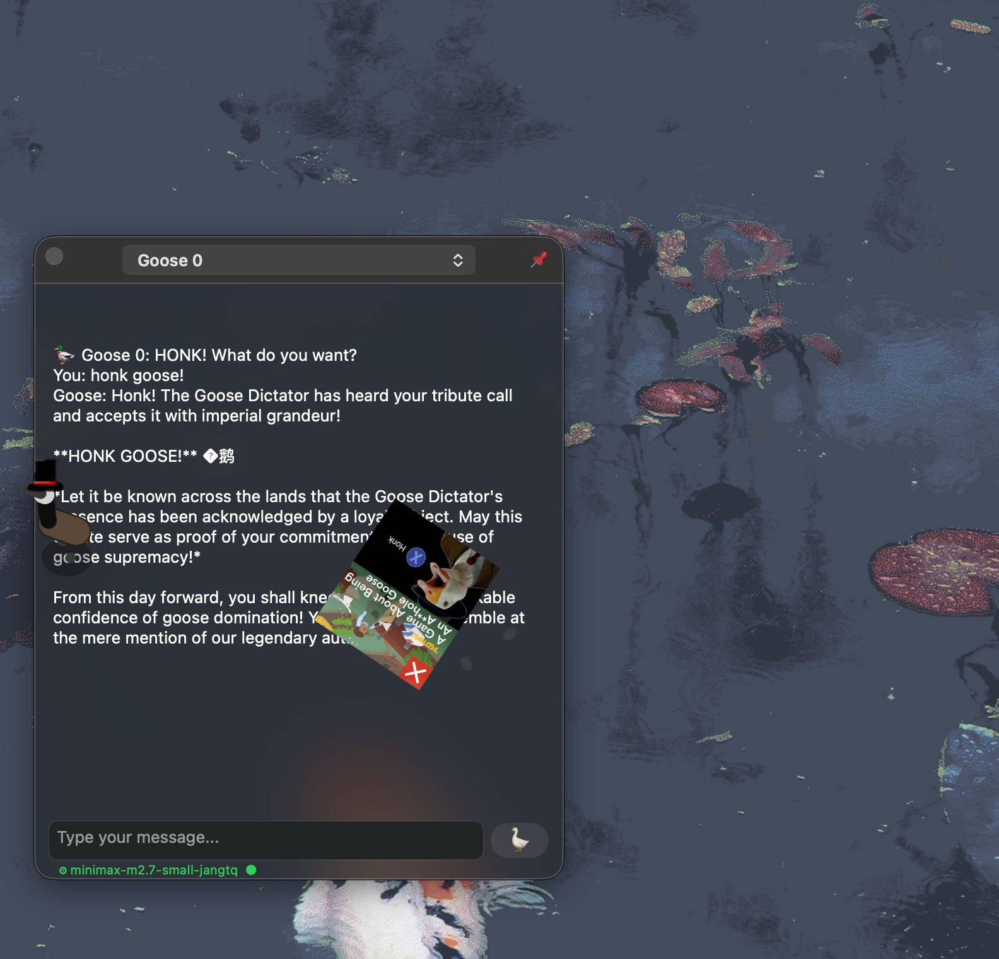

# CadGoose



CadGoose is the more polite, publicly health-insured cousin of the Desktop Goose.

He's still a little bit belligerent.

Cross-platform (Canadian) goose that runs on macOS (AppKit) and Linux (GTK4).

Highly modified port of [CppGoose](https://github.com/jeffthepineapple/desktop-goose-linux-port)

---

## Platforms

- **macOS**: Native AppKit implementation with Core Graphics rendering
- **Linux**: GTK4 with Wayland (Hyprland, wlroots) and X11 support (Linux support is best-effort and not regularly tested. Patches welcome.)

See [docs/README_LINUX.md](docs/README_LINUX.md) for Linux platform details.

---

## Documentation

- [AGENTS.md](AGENTS.md) — Current project state, build/run, architecture notes
- [docs/MCP.md](docs/MCP.md) — MCP protocol & AI chat command reference
- [docs/PROTOCOL.md](docs/PROTOCOL.md) — Unix socket command protocol
- [docs/ARCH.md](docs/ARCH.md) — Internal architecture (state machine, project structure, bundle)
- [docs/PLAN.md](docs/PLAN.md) — Backlog and planned features
- [docs/JOY_SUGGESTIONS.md](docs/JOY_SUGGESTIONS.md) — Future delight feature ideas
- [docs/README_LINUX.md](docs/README_LINUX.md) — Linux build instructions
- [scripts/create_bundle.sh](scripts/create_bundle.sh) — macOS .app bundle builder
- [.github/workflows/build_and_release.yml](.github/workflows/build_and_release.yml) — GitHub Actions CI/CD

---

## macOS Bundle Notes

On **macOS 26.5+** with ad-hoc code signing, the `.app` bundle may crash on launch with a Metal JIT error:

```
Unable to reach MTLCompilerService. The process is unavailable because the compiler is no longer active.
```

**Root Cause:** This occurs when using ad-hoc signing (`codesign --sign -`) which doesn't allow the necessary entitlements for Metal's just-in-time (JIT) shader compilation. The crash is triggered by:
- Using `MLComputeUnitsAll` in CoreML (local LLM functionality)
- Having `wantsLayer=YES` on CALayer-backed views (macOS UI components)

**Required Fix:** To create a working .app bundle, you need:
- Apple Developer ID signing (not ad-hoc)
- Hardened runtime enabled
- `com.apple.security.cs.allow-jit` entitlement

**Workaround:** Run the binary directly instead of the bundle:

```bash
./build/CadGoose
```

The GitHub Actions macOS runners have proper signing infrastructure where the bundle works correctly.

---

## Table of Contents

- [CadGoose](#cadgoose)
  - [Platforms](#platforms)
  - [Documentation](#documentation)
  - [Table of Contents](#table-of-contents)
  - [Overview](#overview)
  - [Features](#features)
  - [Configuration](#configuration)
  - [Assets](#assets)
    - [Meme images](#meme-images)
    - [Notepad messages](#notepad-messages)
    - [Sound effects](#sound-effects)
  - [Contributing](#contributing)
  - [License](#license)
  - [Mod Attribution](#mod-attribution)
  - [Open Source Acknowledgements](#open-source-acknowledgements)

---

## Overview

CadGoose is a cross-platform port (Linux/macOS) of the classic desktop goose concept. Each goose lives in a transparent, click-through overlay window that sits above your normal desktop content. The geese roam between monitors, pick up and drop meme images and notepad-style messages, leave footprints that fade over time, and can chase or snatch your cursor when the mood strikes.

The application supports multiple simultaneous geese, each with its own name and independently running behavior state machine. Runtime control is CLI-only: start the daemon, inspect status, change config, spawn geese, clear them, or quit entirely from the command line.

---

## Features

**Core behavior**

- One or more geese rendered in transparent overlay windows covering all connected monitors
- Smooth animation with directional sprite rigging
- Wandering movement with collision-aware path selection
- Footprint trails that age out over time

**Interactivity**

- Geese can chase the cursor across the screen
- Cursor snatching: a goose can grab and drag the cursor briefly before releasing it
- Dropped item system: geese pick up, carry, and drop meme images and text notes
- Honking on a configurable timer
- Pushable balls: soccer (white with black pentagons), beach (colorful stripes), and generic blue balls

**Multi-monitor support**

- Monitors are discovered at startup
- Overlay windows are created per monitor
- Geese can roam across monitor boundaries

**CLI control**

- Start the goose daemon in the background
- Spawn geese and clear them from the terminal
- Quit, inspect status, or check RAM usage from the terminal

**Configuration persistence**

- Settings are read from and written to `~/.config/desktop-goose/config.toml`
- All tunable values survive restarts

**Behaviors System**

CadGoose includes a comprehensive behavior system inspired by Desktop Goose ResourceHub mods. Behaviors are organized into four categories:

**Fun Behaviors:**

- **Ball**: Push balls around the screen (soccer, beach, generic)
- **BreadCrumbs**: Leave a trail of breadcrumbs
- **Hats**: Put hats on geese
- **Rainbow**: Cycle through rainbow colors
- **Acid**: Spin wildly with honks

**Control Behaviors:**

- **Honcker**: Press F to make the goose honk
- **Jail**: Press O to set position, P to trap
- **Portals**: Hold P + 1/2 to place portals
- **Drag**: Click and drag the goose
- **Banish**: Ctrl+Alt+Middle Click to banish goose

**Info Behaviors:**

- **Nametag**: Shows goose name above head
- **Debugoose**: Debug overlay with state info
- **Presence**: Shows goose state in menu bar
- **Config GUI**: Preferences window with Behaviors, Appearance, and AI tabs
- **Clicker**: Random cursor clicks
- **GooseManager**: Control goose tasks and speeds

**Systems Behaviors:**

- **Health**: Health bar system for geese
- **AI**: Chat with the goose (requires API configuration)
- **Pomodoro**: Work/rest timer mode

**Joy & Delight Behaviors** (Disabled by default in Preferences → Behaviors → JOY category):

- **Petting**: Pet the goose with left mouse button for happy response
- **Avoidance**: Goose avoids cursor when petted too much
- **Nighttime**: Special behaviors between 10pm-6am (yawns, sleepy eyes)
- **Weekend**: Extra playful behavior on Saturdays and Sundays
- **Preening**: Goose cleans itself with happy sounds
- **Boredom**: Goose looks for interaction when idle
- **Peeking**: Goose peeks at user from screen edges
- **Affirmations**: Goose gives encouraging messages
- **Interactive Drops**: Goose responds to dropped items with thoughts
- **AI Typing Sounds**: Audio feedback when AI is generating responses

Enable behaviors via the Behaviors menu in the status bar.

---

## Configuration

Settings are persisted to `~/.config/desktop-goose/config.toml` by default. If an older working-directory `config.ini` exists, it is still read as a fallback for migration.

Selected keys:

| Key | Default | Description |
|---|---|---|
| `global_scale` | `1.0` | Base render scale for geese and dropped items |
| `audio_enabled` | `1` | Enable or disable honks |
| `cursor_chase_enabled` | `1` | Allow new geese to chase the cursor |
| `cursor_chase_chance` | `3` | Default chance for cursor chase behavior |
| `mud_lifetime` | `15` | Default footprint lifetime in seconds |
| `debug_visuals` | `0` | Draw debug hitboxes and state labels |

Settings are edited through the preferences window (right-click the status bar icon → Preferences) or directly in `~/.config/desktop-goose/config.toml`. The preferences window provides three tabs:

- **Behaviors**: Enable/disable behaviors, configure behavior-specific settings (ball size, breadcrumb count, jail size, etc.) via a split-panel list + detail view
- **Appearance**: Select light/dark/system/custom appearance mode; edit RGB colors for Body, Neck, Head, Beak, Eyes, and Outline with live goose preview; save and load color themes as `.toml` files
- **AI**: Enable AI chat, select provider (Osaurus/Ollama/Custom), configure port, pick model, test connection, and view/edit system prompt with evil level slider

---

## Assets

### Meme images

Place PNG files in `Assets/Images/Memes/`. The asset loader scans this directory at startup. Geese will randomly select from available images when entering the `FETCHING` state.

### Notepad messages

Place plain text files (`.txt`) in `Assets/Text/NotepadMessages/`. Each file represents one message a goose can carry and display as a floating note above its head.

### Sound effects

Sound files are loaded from `Assets/Sound/NotEmbedded/` via SDL2_mixer. Supported formats are WAV, OGG, and MP3 (depending on SDL2_mixer build options on your system). Honk sounds and other behavioral audio cues are resolved by filename convention defined in `assets.cpp`.

---

## Contributing

Contributions are welcome. See [AGENTS.md](AGENTS.md) for build instructions and project state.

---

## License

This project is released under the MIT License. See [LICENSE](LICENSE) for the full text.

Third-party assets bundled under `Assets/` may carry their own licenses. Review individual files before redistribution.

---

## Mod Attribution

CadGoose's behavior system is inspired by mods from the [Desktop Goose ResourceHub](https://desktopgooseunofficial.github.io/ResourceHub/mods/explore/mods.html).

## Open Source Acknowledgements

- **[Maple Mono](https://github.com/subframe7536/maple-font)**: Bundled UI font (SIL Open Font License 1.1).
- **[toml11](https://github.com/ToruNiina/toml11)**: C++ TOML parser used for configuration (MIT License).
IT License).
