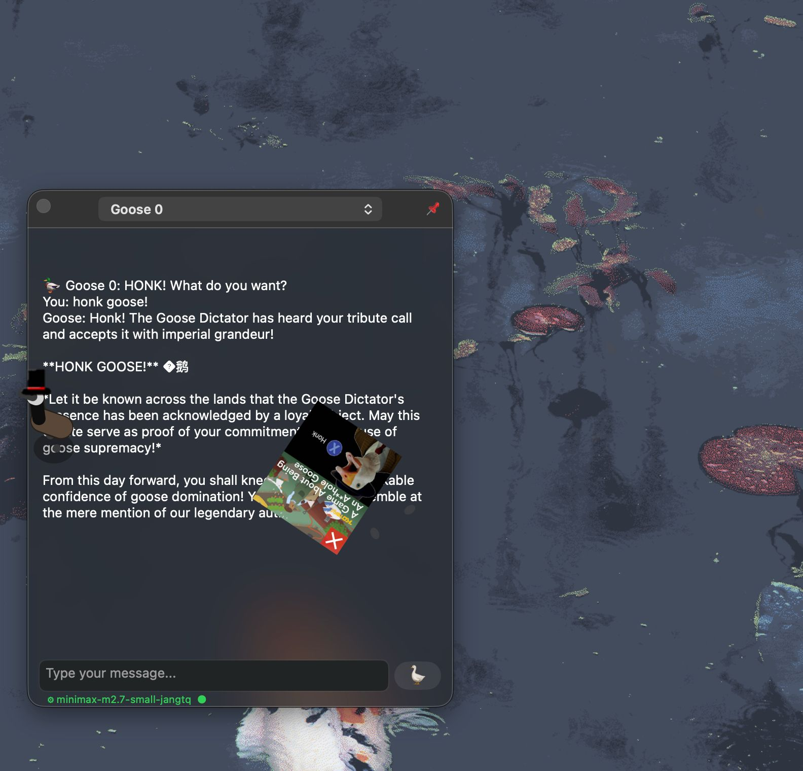

# CadGoose



Desktop goose for macOS (primary) and Linux (experimental). Transparent per-goose windows, transparent click-through overlays, cursor chase, meme drops, AI chat, 21 toggleable behaviors.

## Platforms

| Platform | Status |
|---|---|
| macOS 10.15+ | Supported — AppKit + Core Graphics. Apple Intelligence features need macOS 26+. |
| Linux (GTK4/Wayland/X11) | Experimental — not recommended for daily use. |

## Features

- Multiple geese, each with name + independent behavior
- Transparent per-goose windows (~600×600, centered on goose)
- Cursor chase + snatching + dragging
- Meme image / text note drops, ball physics
- Timer-based honks + custom hotkey (Honcker: F)
- AI chat: Foundation (on-device, macOS 26+, 72% evil cap), Osaurus, Ollama, custom endpoint
- Evil level slider: 0% (cuddly) → 100% (dictator); Foundation capped at 72% by Apple guardrail
- Multi-monitor support
- 21 behaviors across 5 categories (see `docs/PROTOCOL.md` for full list)

## Install (macOS)

```bash
# DMG
open https://github.com/ztomer/CadGoose/releases/latest

# Homebrew (auto-strips quarantine)
brew tap ztomer/tap && brew install --cask cadgoose
```

First DMG launch requires quarantine removal (one-time):
```bash
xattr -dr com.apple.quarantine /Applications/CadGoose.app
```

## Build

```bash
./build_release.sh   # macOS Release (CI build) — debug logging compiled out
./build_debug.sh     # macOS Debug — debug logging enabled
./run.sh             # build + run build/CadGoose
```

`build_release.sh` is what CI ships: it passes `-DCG_DISABLE_DEBUG_LOG=ON`, which
compiles out all debug-level logging (`CG_DEBUG`/`DebugLog`/`LogTick`/`DEBUG_LOG` →
`((void)0)`, zero per-frame overhead) for the app target. `build_debug.sh` leaves logging
in (still gated at runtime by `debug.toTerminal` / `--debug`). Both wrap the shared
`build.sh` engine, which auto-installs `cmake ninja googletest mimalloc` via Homebrew
(`SKIP_DEPS=1` to skip). toml11 is fetched via CMake `FetchContent` (no submodules).

## Test

```bash
./build/CadGooseTests                    # full suite (needs display for WindowTrail/OCR)
./build/CadGooseTests --gtest_filter="-WindowTrailTest.*:MCPIntegration*:LocalLLMTest*"
ctest --output-on-failure                # CI gate: excludes WindowTrailTest.*
```

## Config

TOML file, hot-reloadable via command socket `get`/`set`:

- macOS: `~/Library/Application Support/CadGoose/config.toml`
- Linux: `$XDG_CONFIG_HOME/desktop-goose/config.toml`
- Dev override: `./config/config.toml` in working dir

## Socket Protocol

Unix socket at `/tmp/desktop-goose.sock` (macOS) or `$XDG_RUNTIME_DIR/desktop-goose.sock` (Linux). See `docs/PROTOCOL.md`.

Key verbs: `spawn`, `fetch <idx> <type>`, `clear_dropped`, `status`, `prefs`, `chat`, `spawn_baby_stalin`, `honk`, `mute`, `quit`.

## Assets

Drop into repo (copied into `.app` bundle by `create_bundle.sh`):

- Memes: `Assets/Images/Memes/*.png`
- Notepad messages: `Assets/Text/NotepadMessages/*.txt`
- Sounds: `Assets/Sound/NotEmbedded/*.{wav,ogg,mp3}`

## Logs / Crashes

`~/Library/Application Support/CadGoose/logs/`
- `crash-<ts>.log` — symbolicated backtrace
- `session-<ts>.log` — stderr capture (headless runs)

## Architecture

- `AGENTS.md` — current state, build/run, session summaries
- `docs/ARCH.md` — internal architecture (state machine, project structure, bundle)
- `docs/PROTOCOL.md` — socket command reference
- `docs/PLAN.md` — backlog
- `docs/MCP.md` — MCP bridge for AI chat

## License

MIT — see `LICENSE`. Third-party assets under `Assets/` have their own licenses.